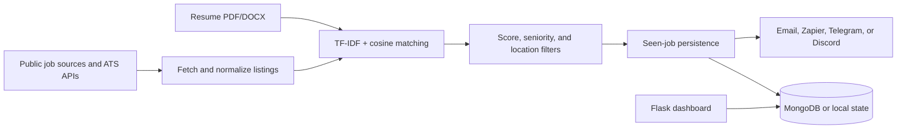

# A-Jent

An autonomous job and internship exploration tool that discovers fresh
listings, scores them against a resume, and sends matching opportunities to
your preferred notification channel.


## Executive Summary

A-Jent runs scheduled searches against public job sources and ATS endpoints.
It extracts resume text, calculates local TF-IDF cosine similarity, filters
results by seniority and location, deduplicates previously seen listings, and
delivers new matches through email, Zapier, Telegram, or Discord.

```
resume.pdf/.docx --------> resume text extraction
                                    |
     RemoteOK / Arbeitnow / Jobicy / Himalayas / HN / WWR / (Greenhouse/Lever)
                                    |
                    TF-IDF + cosine similarity scoring  <-- the "AI" layer
                                    |
                       filter (score + seniority) + dedupe
                                    |
                       POST new matches --> Zapier webhook
                                    |
                Zapier: Catch Hook -> Gmail "Send Email"
```

## System Architecture



## Feature Highlights

- Public-source discovery for remote, internship, entry-level, and junior roles.
- Resume-aware matching without requiring an external AI API key.
- Duplicate suppression so the same listing is not repeatedly delivered.
- Optional company tracking through Greenhouse and Lever endpoints.
- Multiple notification backends with direct Gmail fallback.
- Flask dashboard for reviewing agent activity and persisted job data.

## Why Not LinkedIn / Indeed

Both require a login to see full search results and explicitly forbid
automated scraping in their Terms of Service. There's no keyless,
ToS-compliant way to hit either continuously — this is a hard line, not a
missing feature. If you get official access later (Indeed Publisher API,
LinkedIn Talent Solutions), those use real API keys and slot in as one more
`fetch_*` function each, same pattern as the ones already here.

What's included instead casts a genuinely wide net: RemoteOK, Arbeitnow,
Jobicy, and Himalayas are all general job boards with public JSON APIs.
Greenhouse and Lever are the two most common ATS platforms — thousands of
companies host their real career pages there with a public, unauthenticated
JSON endpoint (not scraping — it's the intended public interface), so you
can track specific companies you care about directly.

## Tech Stack

| Component | Technology | Purpose |
| :--- | :--- | :--- |
| Agent | Python | Scheduling, fetching, scoring, and notifications |
| Matching | scikit-learn TF-IDF and cosine similarity | Resume-to-listing relevance |
| Dashboard | Flask, HTML, CSS, JavaScript | Local monitoring and review |
| Persistence | MongoDB with JSON fallback state | Users, subscriptions, and seen jobs |
| Browser automation | Playwright | Optional source-specific workflows |

## Setup and Run

### Prerequisites

- Python 3.10 or newer
- MongoDB if using the multi-user dashboard persistence path
- A resume file in PDF or DOCX format

### Install dependencies

```bash
cd a-jent
pip install -r requirements.txt
```

### Configure the agent

Drop it in this folder as `resume.pdf` or `resume.docx` (matches the
default `RESUME_PATH`), or point elsewhere:

```bash
export RESUME_PATH="/path/to/resume.pdf"
```

The whole resume text is used for TF-IDF similarity scoring — no need to
hand-pick keywords. If no resume is found, it falls back to a generic
internship/entry-level text profile.

Copy `.env.example` to `.env` and provide only the services you intend to use,
or edit the documented values in `config.yaml`. Credentials and personal data
are intentionally excluded from version control.

### Run one search cycle

```bash
python job_search_agent.py --once
```

### Run continuously

```bash
python job_search_agent.py
```

### Start the dashboard

```bash
python dashboard/app.py
```

Open `http://127.0.0.1:5000` in a browser.

## Optional Configuration

Edit `GREENHOUSE_COMPANY_SLUGS` / `LEVER_COMPANY_SLUGS` at the top of
`job_search_agent.py`. Find a company's slug from their careers URL:
`boards.greenhouse.io/stripe` → `"stripe"`, `jobs.lever.co/netflix` →
`"netflix"`.

### Direct Gmail

### Option A - Direct Gmail (simplest, no Zapier needed for email)

1. Turn on 2-Step Verification on your Google account, if it isn't already:
   https://myaccount.google.com/security
2. Generate an **App Password**: https://myaccount.google.com/apppasswords
   - This is a 16-character password Google generates specifically for
     apps/scripts like this one. It is **not** an API key and **not** your
     real password — it only allows SMTP mail sending, and you can revoke
     it any time from the same page.
3. Set these before running the agent:
   ```bash
   export GMAIL_ADDRESS="you@gmail.com"
   export GMAIL_APP_PASSWORD="xxxxxxxxxxxxxxxx"   # the 16-char app password, no spaces
   export GMAIL_TO_ADDRESS="you@gmail.com"          # optional, defaults to GMAIL_ADDRESS
   ```
4. That's it — the agent will email you directly via Gmail's SMTP server.
   No Zapier step required for this path.

### Option B - Via Zapier (adds Sheets/Slack logging, other automations)

Keep this if you still want the Zap for logging matches to a spreadsheet or
pinging Slack alongside the email — see "Build the Zap" below. If both
Zapier and direct Gmail are configured, Zapier is tried first and direct
Gmail is the automatic fallback if the webhook ever fails.

To force *only* direct Gmail even when a Zapier URL is set:
```bash
export FORCE_DIRECT_GMAIL=true
```

### Zapier

1. zapier.com → **Create Zap**.
2. **Trigger**: "Webhooks by Zapier" → **Catch Hook**. Copy the generated URL.
3. **Action**: **Gmail** (already connected) → **Send Email**.
   - Subject: `New job match: {{title}} at {{company}}`
   - Body: include `{{title}}`, `{{company}}`, `{{url}}`, `{{source}}`,
     `{{match_score}}` — map these once you've sent a test payload through.
4. Turn the Zap **ON**.

Want a running log too? Add a second action: **Google Sheets → Create
Spreadsheet Row** with the same fields. Prefer Slack? Swap Gmail for
**Slack → Send Channel Message**.

### Other notification channels

Telegram and Discord can be enabled with the corresponding values in
`.env.example` and `config.yaml`.

## Run 24/7

- Linux: use `job_agent.service` with systemd.
- Windows: use the Task Scheduler instructions in `schedule_windows.md`.
- Foreground: run `python job_search_agent.py` for a simple long-running loop.

## Tuning

```bash
export ZAPIER_WEBHOOK_URL="https://hooks.zapier.com/hooks/catch/123456/abcdef/"
```

- `SIMILARITY_THRESHOLD` (0–1): raise it for fewer, more precise matches;
  lower it for broader results. Start at the default 0.12 and adjust after
  watching a few cycles.
- `LEVEL_FILTERS`: restricts to internship/entry-level/junior/new-grad
  postings. Set to `[]` to see everything above the similarity bar
  regardless of seniority.
- `CHECK_INTERVAL_HOURS`: how often it checks. Job boards don't update
  faster than hourly, so 1–3 hours is plenty and avoids hammering the free
  APIs.
- `seen_jobs.json`: the dedupe memory. Delete it to force a fresh full
  re-scan and re-notification of everything currently matching.

## Folder Structure

```
a-jent/
├── job_search_agent.py       # Search, score, filter, and notify
├── setup_wizard.py           # Interactive configuration helper
├── db.py                     # Persistence and user/subscription operations
├── config.yaml               # Non-secret application defaults
├── dashboard/                # Flask dashboard and browser assets
├── scrapers/                 # Source-specific scraper modules
├── requirements.txt          # Python dependencies
├── schedule_windows.md       # Windows scheduling instructions
└── job_agent.service         # Linux systemd service definition
```

Runtime data, credentials, resumes, browser profiles, logs, uploads, and user
records are excluded by `.gitignore`.
